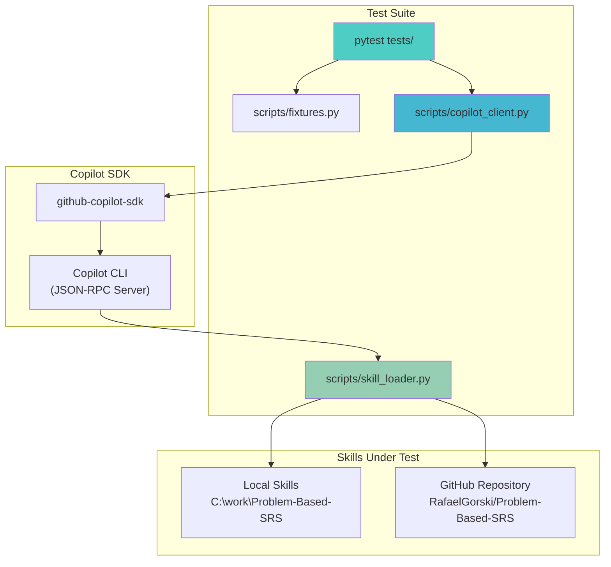
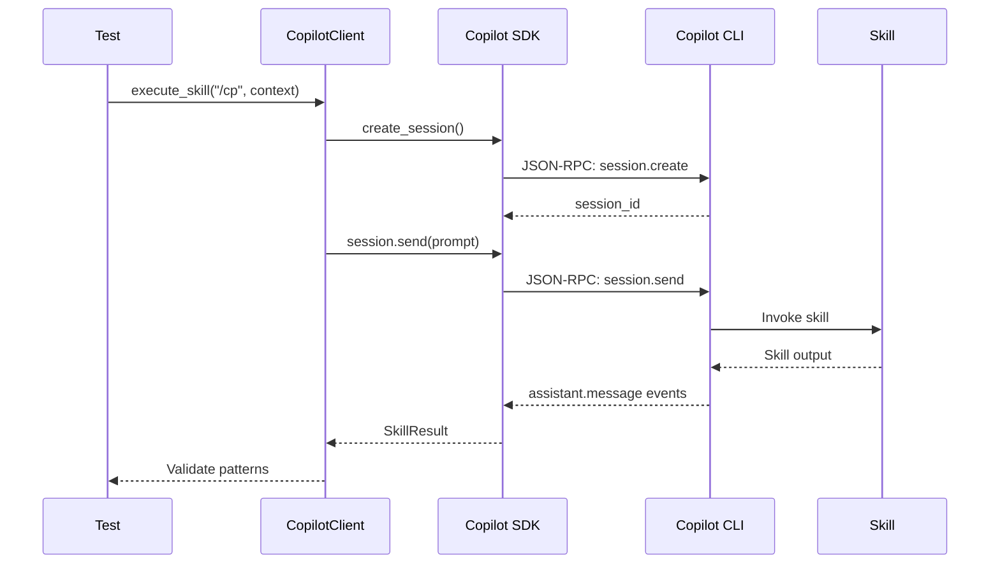
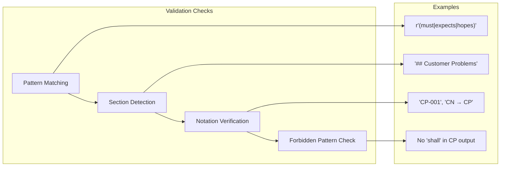

# Problem-Based SRS Isolated Tests

[](https://www.python.org/downloads/)
[](https://opensource.org/licenses/MIT)

Black-box test suite for validating [Problem-Based SRS](https://github.com/RafaelGorski/Problem-Based-SRS) agent skills without modifying the skills themselves. Uses the [GitHub Copilot SDK](https://github.com/github/copilot-sdk) to invoke skills and validate outputs.

## Quick Start

| Command | What it does |
|---------|--------------|
| `.\run-all-tests.ps1` | Run **all 60 tests** once (default) |
| `.\run-all-tests.ps1 -Local C:\work\Problem-Based-SRS` | Run tests using **local** skills folder |
| `.\run-all-tests.ps1 -Unit` | Run unit tests only (excludes e2e) |
| `.\run-all-tests.ps1 -E2E` | Run e2e tests only (`test_e2e_*.py`) |
| `.\run-all-tests.ps1 -Quick` | Quick smoke test (3 key tests) |
| `.\run-all-tests.ps1 -Full` | All tests + coverage + mutation |
| `.\run-all-tests.ps1 -Coverage -Html` | Coverage analysis with HTML report |

### Using Local Skills (`-Local`)

All helper scripts support `-Local <path>` to use a local skills folder instead of cloning from GitHub:

```powershell
.\run-all-tests.ps1 -Local C:\work\Problem-Based-SRS
.\run-unit-tests.ps1 -Local C:\work\Problem-Based-SRS -Skill customer-problems
.\run-e2e-tests.ps1 -Local C:\work\Problem-Based-SRS -Workflow crm
.\test-skill.ps1 -Skill customer-problems -Local C:\work\Problem-Based-SRS
```

Without `-Local`, tests clone from GitHub (default behavior for CI/CD).

### Standalone Scripts

| Script | Purpose |
|--------|---------|
| `run-unit-tests.ps1` | Run tests with skill/test filtering |
| `run-e2e-tests.ps1` | Run workflow-specific e2e tests |
| `run-mutation-tests.ps1` | Coverage analysis + mutation discovery |
| `verify-setup.ps1` | Check environment setup |
| `test-skill.ps1` | Interactively test a single skill |
| `generate-report.ps1` | Generate test reports |

## Architecture



## Test Flow



## Skills Tested

| Skill | Command | Test File | What's Validated |
|-------|---------|-----------|------------------|
| customer-problems | `/cp` | `test_customer_problems.py` | CP notation, classification, no FR leakage |
| software-glance | `/glance` | `test_software_glance.py` | System boundary, actors, interfaces |
| customer-needs | `/cn` | `test_customer_needs.py` | CN notation, outcome classes, CP traceability |
| software-vision | `/vision` | `test_software_vision.py` | Positioning, stakeholders, features |
| functional-requirements | `/fr` | `test_functional_requirements.py` | FR notation, CN traceability, acceptance criteria |
| zigzag-validator | `/zigzag` | `test_zigzag_validator.py` | Traceability chain validation |
| complexity-analysis | `/complexity` | `test_complexity_analysis.py` | Axiomatic Design analysis |
| problem-based-srs | `/problem-based-srs` | `test_problem_based_srs.py` | Orchestrator step detection |

## Quick Start

### Prerequisites

- Python 3.11+
- GitHub Copilot CLI installed and authenticated
- Local skills repository (or GitHub access for remote)

### Installation

```bash
# Clone this repository
git clone https://github.com/RafaelGorski/Problem-Based-SRS-Isolated-Tests.git
cd Problem-Based-SRS-Isolated-Tests

# Install dependencies
pip install -e ".[dev]"
```

### Running Tests

```bash
# Run all tests (clones skills from GitHub by default)
pytest

# Run specific skill tests
pytest tests/test_customer_problems.py -v

# Run single test
pytest tests/test_customer_problems.py::TestCustomerProblemsSkill::test_cp_generates_structured_notation -v

# Use local skills folder instead
SKILL_DIR=C:\work\Problem-Based-SRS pytest
```

### Environment Variables

| Variable | Default | Description |
|----------|---------|-------------|
| `SKILL_DIR` | *(unset)* | Local path to skills. If set, uses local folder instead of GitHub |
| `SKILL_REPO` | `https://github.com/RafaelGorski/Problem-Based-SRS` | GitHub repository URL |

**Default behavior:** Skills are cloned from GitHub to a temp folder at test setup to ensure latest version.  
**Override:** Set `SKILL_DIR=/path/to/local/skills` to use a local folder for development.

## How to Run and Check Results

### Step 1: Verify Prerequisites

```bash
# Check Python version (must be 3.11+)
python --version

# Check Copilot CLI is installed and authenticated
copilot --version
copilot auth status
```

### Step 2: Run the Full Test Suite

```bash
# Run all tests with verbose output
pytest -v

# Run with detailed output showing each assertion
pytest -v --tb=short
```

**Expected output for passing tests:**
```
tests/test_customer_problems.py::TestCustomerProblemsSkill::test_cp_generates_structured_notation PASSED
tests/test_customer_problems.py::TestCustomerProblemsSkill::test_cp_includes_classification PASSED
...
========================= 42 passed in 120.5s =========================
```

### Step 3: Run Individual Skill Tests

```bash
# Test only Customer Problems skill
pytest tests/test_customer_problems.py -v

# Test only Functional Requirements skill
pytest tests/test_functional_requirements.py -v

# Test orchestrator
pytest tests/test_problem_based_srs.py -v
```

### Step 4: Check Test Results

#### Understanding Test Output

| Status | Meaning |
|--------|---------|
| `PASSED` | Skill output matched expected patterns |
| `FAILED` | Skill output missing required patterns or contained forbidden patterns |
| `ERROR` | Test setup failed (usually SDK/CLI connection issues) |
| `SKIPPED` | Test was skipped (usually due to missing dependencies) |

#### Interpreting Failures

When a test fails, pytest shows:
1. **Which assertion failed** - e.g., "Missing pattern: CP-"
2. **The actual content** - What the skill returned
3. **The expected pattern** - What was being checked

**Example failure output:**
```
FAILED tests/test_customer_problems.py::test_cp_includes_classification
    AssertionError: CP output should classify problems
    
    assert result.contains_pattern(r"(Obligation|Expectation|Hope)")
    
    Content received:
    "Here are the problems identified..."
```

### Step 5: Generate Test Reports

```bash
# Generate JUnit XML report (for CI/CD)
pytest --junitxml=results.xml

# Generate HTML report (requires pytest-html)
pip install pytest-html
pytest --html=report.html --self-contained-html

# Show test durations (find slow tests)
pytest --durations=10
```

### Step 6: Debug Failing Tests

```bash
# Run with full traceback
pytest -v --tb=long

# Stop on first failure
pytest -x

# Run only previously failed tests
pytest --lf

# Run with print statements visible
pytest -s

# Run specific failing test with debug output
pytest tests/test_customer_problems.py::TestCustomerProblemsSkill::test_cp_generates_structured_notation -v -s
```

### Step 7: Check Skill Output Manually

For debugging, you can inspect what the skill actually returned:

```python
# In Python REPL or script
import asyncio
from scripts.copilot_client import SkillTestClient

async def debug_skill():
    async with SkillTestClient() as client:
        result = await client.execute_skill("/cp\n\nA warehouse loses $50k/month due to inventory errors.")
        print("=== CONTENT ===")
        print(result.content)
        print("\n=== CHECKS ===")
        print(f"Has CP notation: {result.has_cp_notation()}")
        print(f"Has classification: {result.contains_pattern(r'(Obligation|Expectation|Hope)')}")

asyncio.run(debug_skill())
```

### Common Issues and Solutions

| Issue | Solution |
|-------|----------|
| `CopilotClient connection failed` | Run `copilot auth login` to authenticate |
| `Skill not found` | Check `SKILL_DIR` points to valid skills directory |
| `Timeout errors` | Increase timeout in `SkillTestClient(timeout=180)` |
| `Import errors` | Run `pip install -e ".[dev]"` from project root |
| `Permission denied` | Run terminal as administrator (Windows) |

### CI/CD Integration

For GitHub Actions (uses GitHub by default, no env vars needed):

```yaml
- name: Run Tests
  run: |
    pip install -e ".[dev]"
    pytest --junitxml=results.xml -v
    
- name: Upload Test Results
  uses: actions/upload-artifact@v4
  with:
    name: test-results
    path: results.xml
```

## PowerShell Helper Scripts

Located in the **project root**, these helpers simplify manual testing:

### verify-setup.ps1
Verify your environment is correctly configured:
```powershell
.\verify-setup.ps1          # Check environment
.\verify-setup.ps1 -Fix     # Auto-fix issues
```

### run-unit-tests.ps1
Run unit tests with filtering and parallel options:
```powershell
.\run-unit-tests.ps1                                    # Run all tests
.\run-unit-tests.ps1 -Skill customer-problems           # Test one skill
.\run-unit-tests.ps1 -Test "test_cp_generates" -Verbose # Filter by name
.\run-unit-tests.ps1 -FailFast                          # Stop on first failure
.\run-unit-tests.ps1 -Parallel 4                        # Run with 4 parallel workers
.\run-unit-tests.ps1 -n 2                               # Shorthand for -Workers 2
```

### run-e2e-tests.ps1
Run end-to-end workflow tests:
```powershell
.\run-e2e-tests.ps1                          # Run all e2e tests
.\run-e2e-tests.ps1 -Workflow quick          # Quick validation (3 tests)
.\run-e2e-tests.ps1 -Workflow full           # Full 5-step workflow
.\run-e2e-tests.ps1 -SkillSource github      # Use GitHub skills
.\run-e2e-tests.ps1 -Parallel 4              # Run with 4 parallel workers
```

### test-skill.ps1
Test a single skill interactively:
```powershell
.\test-skill.ps1 -Skill customer-problems -UseFixture inventory
.\test-skill.ps1 -Skill software-glance -Context "My custom context..."
.\test-skill.ps1 -Skill zigzag-validator -ShowEvents
```

### generate-report.ps1
Generate test reports:
```powershell
.\generate-report.ps1                        # Console output with durations
.\generate-report.ps1 -Format junit          # JUnit XML for CI/CD
.\generate-report.ps1 -Format html           # HTML report (opens in browser)
```

### run-mutation-tests.ps1
Run mutation testing and coverage analysis:
```powershell
.\run-mutation-tests.ps1                     # Run coverage + mutation discovery
.\run-mutation-tests.ps1 -Coverage           # Coverage analysis only
.\run-mutation-tests.ps1 -Mutation           # Mutation discovery only
.\run-mutation-tests.ps1 -Parallel 8         # Use 8 workers for coverage tests
```

> **Note**: Mutation testing uses WSL + mutmut for mutant generation. Since tests 
> require the Windows-only Copilot SDK, mutation runs in **discovery mode** - 
> identifying mutation points without executing tests. Use coverage analysis to 
> verify test effectiveness.

### run-all-tests.ps1
Master test runner for all test types:
```powershell
.\run-all-tests.ps1                          # Unit + E2E tests
.\run-all-tests.ps1 -Full                    # Everything including mutation
.\run-all-tests.ps1 -Quick                   # Quick smoke tests
.\run-all-tests.ps1 -Unit                    # Unit tests only
.\run-all-tests.ps1 -E2E                     # E2E tests only
.\run-all-tests.ps1 -Coverage                # Coverage analysis
.\run-all-tests.ps1 -Full -Html              # Full suite with HTML reports
.\run-all-tests.ps1 -FailFast                # Stop on first failure
```

## Mutation Testing & Coverage

### Coverage Analysis

Coverage analysis measures which lines of code are exercised by tests. Run with:

```powershell
.\run-mutation-tests.ps1 -Coverage           # Quick coverage report
.\run-mutation-tests.ps1 -Coverage -Html     # HTML report with line-by-line details
```

Coverage includes both `scripts/` and `tests/` directories. Reports are saved to `reports/coverage/`.

### Mutation Testing (Discovery Mode)

Mutation testing identifies code changes that SHOULD cause test failures. The test suite uses **mutmut** via WSL to generate mutants.

```powershell
.\run-mutation-tests.ps1 -Mutation           # Generate mutation points
```

> **Why Discovery Mode?** The Copilot SDK only works on Windows, but mutmut requires
> Linux/WSL. Mutation discovery identifies WHERE mutations could be applied, helping
> you understand which code paths need better test coverage.

#### WSL Setup (Required for Mutation Testing)

```bash
wsl -d Ubuntu bash
sudo apt-get update && sudo apt-get install -y python3-pip
pip3 install mutmut --break-system-packages
exit
```

### Quick Start

```powershell
# Run full coverage + mutation analysis
.\run-mutation-tests.ps1

# Coverage only (faster)
.\run-mutation-tests.ps1 -Coverage -Parallel 8
```

### Understanding Coverage Results

Coverage reports show which lines are executed during tests:

| Metric | Target |
|--------|--------|
| Statement coverage | > 60% |
| Branch coverage | > 50% |
| Missing lines | Listed in report |

### What Gets Analyzed

| Directory | Contents |
|-----------|----------|
| `scripts/` | Core modules (copilot_client, skill_loader, fixtures) |
| `tests/` | Test files themselves |

### Mutation Points Report

When running `-Mutation`, a JSON report is generated:

```json
{
  "total_mutations": 297,
  "files": {
    "skill_loader": 191,
    "copilot_client": 100,
    "fixtures": 6
  },
  "note": "Discovery mode - mutants identified but not tested"
}
```

Higher mutation counts indicate more complex code that should have thorough test coverage.

### Coverage Report

```powershell
.\run-mutation-tests.ps1 -Coverage -Html
# Opens reports/coverage/index.html
```

### CI/CD Integration

```yaml
- name: Run Mutation Tests
  run: |
    pip install -e ".[dev]"
    python -m mutmut run --paths-to-mutate=scripts/
    python -m mutmut results
```

## Technical Decisions & Tradeoffs

### 1. GitHub Copilot SDK vs Direct CLI Invocation

**Decision:** Use `github-copilot-sdk` Python package.

**Rationale:**
- SDK handles CLI process lifecycle automatically
- Provides async/await native interface matching pytest-asyncio
- Manages JSON-RPC communication, reconnection, and error handling
- Type hints throughout for better IDE support

**Tradeoff:** Adds dependency on SDK being installed and maintained. Alternative would be direct subprocess calls to CLI, but that loses streaming, session management, and proper cleanup.

### 2. Local vs Remote Skill Loading

**Decision:** Support both via environment variable.

**Rationale:**
- Local (`SKILL_SOURCE=local`): Fast iteration during development, no network dependency
- Remote (`SKILL_SOURCE=github`): CI/CD uses latest published version, ensures tests match releases

**Tradeoff:** Local testing might pass with unpublished changes that break on CI. Mitigated by running both modes in CI pipeline.

### 3. Black-Box Testing Only

**Decision:** No mocking of skill internals; treat skills as opaque.

**Rationale:**
- Skills are in a separate repository that cannot be modified
- Tests validate observable behavior (output patterns, structure)
- Ensures tests remain valid even if skill implementation changes

**Tradeoff:** Cannot test internal error handling or edge cases that don't manifest in output. Accepted because goal is requirements validation, not unit testing.

### 4. Pattern-Based Validation

**Decision:** Use regex patterns to validate outputs instead of exact string matching.

**Rationale:**
- LLM outputs vary in wording while maintaining semantic correctness
- Patterns capture structural requirements (CP notation, section headings)
- More maintainable than fragile exact matches

**Tradeoff:** Patterns might be too loose (false positives) or too strict (false negatives). Mitigated by testing patterns against known-good and known-bad outputs during development.

### 5. Async Test Framework

**Decision:** Use pytest-asyncio with auto mode.

**Rationale:**
- Copilot SDK is async-native
- Allows concurrent test execution (though skills are stateful)
- Cleaner syntax than manual event loop management

**Tradeoff:** Adds complexity for developers unfamiliar with async testing. Mitigated by clear examples in test files.

### 6. Fixture-Based Test Data

**Decision:** Centralize test data in `scripts/fixtures.py`.

**Rationale:**
- Reusable across all test files
- Single source of truth for business contexts
- Easy to add new test scenarios

**Tradeoff:** Fixtures might not cover edge cases specific to individual skills. Tests can define local data when needed.

## Project Structure

```
Problem-Based-SRS-Isolated-Tests/
├── scripts/                      # Reusable helpers
│   ├── __init__.py
│   ├── copilot_client.py         # SDK wrapper with SkillResult class
│   ├── skill_loader.py           # Local/GitHub skill loading
│   └── fixtures.py               # Test data and expected patterns
├── tests/                        # Test suites
│   ├── __init__.py
│   ├── conftest.py               # Pytest fixtures
│   ├── test_customer_problems.py
│   ├── test_software_glance.py
│   ├── test_customer_needs.py
│   ├── test_software_vision.py
│   ├── test_functional_requirements.py
│   ├── test_zigzag_validator.py
│   ├── test_complexity_analysis.py
│   └── test_problem_based_srs.py
├── .github/
│   └── copilot-instructions.md   # Copilot context for this repo
├── pyproject.toml                # Project config & dependencies
├── README.md                     # This file
└── LICENSE
```

## Validation Approach

Each test validates specific aspects of skill output:



## Contributing

1. Add new test scenarios to `scripts/fixtures.py`
2. Create test methods following existing patterns
3. Run `ruff check` before committing
4. Ensure both local and GitHub modes pass

## License

MIT License - see [LICENSE](LICENSE) for details.
